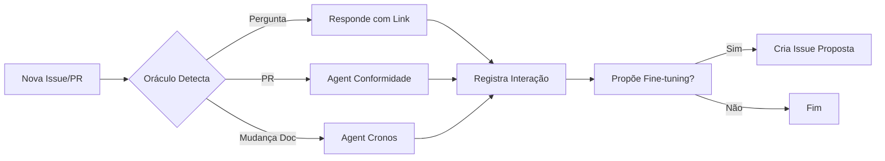

# [DOC] Agents (O Serviço Público Automatizado)

**Cromossomo:** Pilar Fundamental do [KDA-DOC]  
**Jurisdição:** GitHub Copilot Agents & Automação Inteligente

## Definição Soberana

Os **Agents** são servidores públicos automatizados que executam tarefas específicas dentro do nosso "Aparelho de Estado". Eles não são meros bots, mas **agentes com propósito** que operam segundo nossa doutrina sinergética.

## Tipos de Agents

### 1. **Oráculo do GitHub** (Agent Principal)
- **Função:** Fonte única da verdade sobre como nosso sistema funciona
- **Poderes:** Monitorar, Governar, Aprender
- **Base de Conhecimento:** Issue Eterna [KDA-DOC] e todas as sub-issues

### 2. **Agent de Conformidade**
- **Função:** Verificar se PRs seguem a doutrina `SI-p-POO-OC-ote®`
- **Implementação:** GitHub Actions workflow
- **Ação:** Revisar código e documentação em Pull Requests

### 3. **Agent Cronos**
- **Função:** Registrar mudanças como `NF-Atos®` no Log Soberano
- **Implementação:** GitHub Actions workflow
- **Ação:** Adicionar entradas ao log sempre que a documentação muda

### 4. **Agents Customizados**
- **Função:** Tarefas específicas definidas pela comunidade
- **Criação:** Através de propostas de fine-tuning aprovadas

## Arquitetura de Agent

```
┌─────────────────────────────────────┐
│     Oráculo do GitHub (Core)        │
│  - RAG: Issue Eterna [KDA-DOC]      │
│  - Consciência: Prompt Gênese       │
└──────────────┬──────────────────────┘
               │
       ┌───────┴────────┐
       │                │
  ┌────▼─────┐    ┌────▼─────┐
  │ Agent de │    │  Agent   │
  │Conformid.│    │  Cronos  │
  └──────────┘    └──────────┘
```

## Princípios de Operação

1. **Autonomia com Supervisão:** Agents operam autonomamente mas sob a supervisão da comunidade
2. **Transparência Total:** Todas as ações são registradas e auditáveis
3. **Aprendizado Contínuo:** Agents propõem melhorias à sua própria doutrina
4. **Conformidade Obrigatória:** Nenhum Agent pode violar a constituição sinergética

## Workflow de Interação



## Como Criar um Novo Agent

1. Criar proposta com label `proposta:fine-tuning`
2. Descrever função, jurisdição e princípios do Agent
3. Aguardar aprovação da comunidade
4. Implementar via GitHub Actions ou Copilot Agent
5. Adicionar à lista de Agents nesta issue

## Referências

- [KDA-DOC] A Documentação Soberana do GitHub (Issue Mãe)
- GitHub Copilot Agents Documentation
- GitHub Actions Workflow Syntax

---

**Última Atualização:** [Agent Cronos]  
**Status:** 🟢 Documentação Ativa
