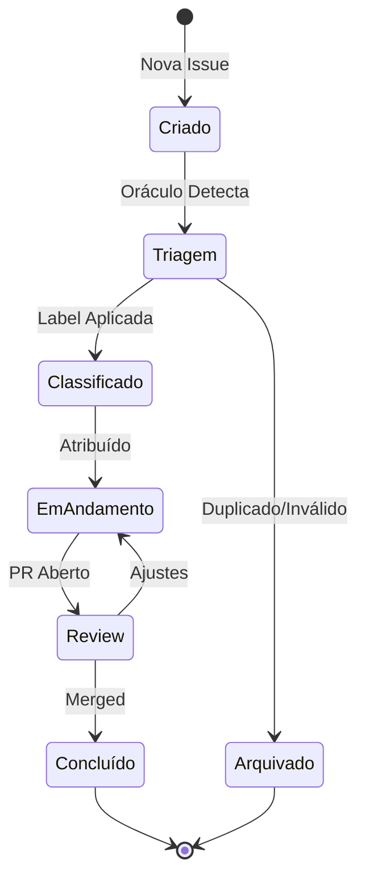

# [DOC] noids® (A Unidade de Vontade)

**Cromossomo:** Pilar Fundamental do [KDA-DOC]  
**Jurisdição:** GitHub Issues & Unidades de Trabalho

## Definição Soberana

Um **noid®** (pronuncia-se "nóide") é uma **Unidade de Vontade** - uma manifestação de intenção, problema ou oportunidade no nosso sistema. No GitHub, os noids® são implementados como **Issues**, mas transcendem a simples definição técnica.

### Etimologia Sinergética

- **no** = "nó" (ponto de convergência)
- **id** = "identidade" (essência única)
- **®** = marca registrada da nossa doutrina

## Taxonomia dos noids®

### 1. **noid-KDA® (Conhecimento, Doutrina, Arquitetura)**
- **Símbolo:** [KDA-DOC]
- **Função:** Fonte da verdade, documentação soberana
- **Exemplo:** Issue Eterna do Oráculo

### 2. **noid-NF® (Nota Fiscal de Atos)**
- **Símbolo:** [NF-Ato]
- **Função:** Registros oficiais de mudanças
- **Exemplo:** Log de alterações na documentação

### 3. **noid-Proposta®**
- **Símbolo:** [PROPOSTA]
- **Função:** Sugestões de melhorias ou emendas
- **Labels:** `proposta:fine-tuning`, `proposta:feature`

### 4. **noid-Bug®**
- **Símbolo:** [BUG]
- **Função:** Relatos de não-conformidade ou erros
- **Labels:** `bug`, `crítico`, `não-conforme`

### 5. **noid-Quest®**
- **Símbolo:** [QUEST]
- **Função:** Perguntas ou pedidos de esclarecimento
- **Labels:** `questão`, `dúvida`

## Ciclo de Vida de um noid®



## Estrutura Ideal de um noid®

```markdown
# [TIPO] Título Descritivo

## Contexto
[Por que este noid® existe?]

## Objetivo
[O que queremos alcançar?]

## Critérios de Aceitação
- [ ] Critério 1
- [ ] Critério 2

## Referências
- Link para [KDA-DOC] relevante
- Links para outros noids® relacionados

## Sub-noids®
- [ ] Sub-tarefa 1
- [ ] Sub-tarefa 2
```

## Labels Obrigatórias

Cada noid® deve ter pelo menos:
1. **Tipo:** `DOC`, `bug`, `feature`, `proposta`, etc.
2. **Prioridade:** `crítico`, `alto`, `médio`, `baixo`
3. **Status:** `triagem`, `aprovado`, `em-andamento`, `bloqueado`

## Como o Oráculo Processa noids®

1. **Detecção:** Novo noid® é criado
2. **Análise:** Oráculo lê título e conteúdo
3. **Classificação:** Identifica tipo e jurisdição
4. **Resposta:** Adiciona comentário com links relevantes
5. **Monitoramento:** Acompanha evolução até conclusão
6. **Aprendizado:** Se detectar lacuna, propõe fine-tuning

## Relação com Playbooks

- **noid®** = Problema/Oportunidade (Issue)
- **Playbook** = Solução/Implementação (Pull Request)
- **NF-Ato®** = Registro do que foi feito

```
noid® → Playbook → Merged → NF-Ato®
```

## Boas Práticas

### ✅ Fazer
- Usar títulos descritivos e claros
- Adicionar contexto suficiente
- Referenciar [KDA-DOC] quando aplicável
- Definir critérios de aceitação
- Manter noids® focados (um objetivo por noid®)

### ❌ Evitar
- Títulos vagos como "Preciso de ajuda"
- Múltiplos objetivos em um único noid®
- Ignorar templates existentes
- Criar noids® duplicados sem verificar

## Comandos do Oráculo

- `/convocar @oraculo-github` - Invocar o Oráculo para ajuda
- `/classificar` - Solicitar classificação do noid®
- `/relacionar #[issue]` - Conectar com outro noid®

## Referências

- [KDA-DOC] A Documentação Soberana do GitHub (Issue Mãe)
- [DOC] Agents (O Serviço Público Automatizado)
- [DOC] Playbooks (Os Decretos Executivos)

---

**Última Atualização:** [Agent Cronos]  
**Status:** 🟢 Documentação Ativa
