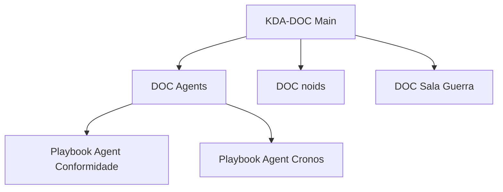

# [DOC] Sala de Guerra (O Painel de Comando)

**Cromossomo:** Pilar Fundamental do [KDA-DOC]  
**Jurisdição:** GitHub Projects, Dashboards & Visualização Estratégica

## Definição Soberana

A **Sala de Guerra** é o centro nervoso do nosso "Aparelho de Estado" - onde a estratégia se encontra com a execução. É o painel de comando que oferece visibilidade total sobre todos os noids®, Playbooks e NF-Atos® em andamento.

## Componentes da Sala de Guerra

### 1. **Painel Principal (GitHub Projects)**
Visualização Kanban da operação:

```
┌──────────┬──────────┬──────────┬──────────┐
│ Triagem  │ Aprovado │ Fazendo  │ Review   │ Feito
├──────────┼──────────┼──────────┼──────────┤
│ noid-123 │ noid-456 │ noid-789 │ noid-012 │ ✓
│ noid-124 │          │ noid-790 │          │ ✓
└──────────┴──────────┴──────────┴──────────┘
```

### 2. **Dashboard de Métricas**
Indicadores de saúde do sistema:
- 📊 Total de noids® ativos
- ⚡ Velocidade de conclusão
- 🎯 Taxa de conformidade (Agent)
- 🔄 Ciclo médio (noid® → Merged)
- 📚 Cobertura documental

### 3. **Mapa de Dependências**
Visualização de como noids® e Playbooks se relacionam:



## Zonas da Sala de Guerra

### 🔴 Zona Crítica
- noids® bloqueados
- PRs com conflitos
- Falhas de conformidade

### 🟡 Zona de Atenção
- noids® sem atualização > 7 dias
- PRs aguardando review > 3 dias
- Propostas pendentes de decisão

### 🟢 Zona Operacional
- noids® em progresso normal
- PRs em review ativa
- Documentação atualizada

### ⚪ Zona Arquivada
- noids® concluídos
- PRs merged
- NF-Atos® registrados

## Views Personalizadas

### View 1: Por Cromossomo (Tipo)
Agrupa por labels [DOC], [BUG], [FEATURE], etc.

### View 2: Por Prioridade
Ordena por `crítico` → `alto` → `médio` → `baixo`

### View 3: Por Guardião
Mostra responsabilidade de cada membro

### View 4: Timeline
Visualização temporal do fluxo de trabalho

## Automações da Sala de Guerra

### Auto-Triagem
```yaml
Quando: Nova issue criada
Então: 
  - Mover para coluna "Triagem"
  - Convocar Oráculo para análise
  - Aplicar label "novo"
```

### Auto-Progress
```yaml
Quando: PR aberto vinculado a issue
Então:
  - Mover issue para "Review"
  - Atualizar status
  - Notificar guardiões
```

### Auto-Conclusão
```yaml
Quando: PR merged
Então:
  - Mover issue para "Feito"
  - Fechar issue automaticamente
  - Agent Cronos registra NF-Ato®
```

## Comandos da Sala de Guerra

- `/status` - Ver status atual de um noid®
- `/priorizar [crítico|alto|médio|baixo]` - Ajustar prioridade
- `/bloquear [motivo]` - Marcar noid® como bloqueado
- `/desbloquear` - Remover bloqueio
- `/arquivar` - Mover para zona arquivada

## Rituais de Guerra

### Daily Sync (Automático)
- Oráculo gera resumo diário às 9h
- Lista mudanças nas últimas 24h
- Destaca itens críticos

### Weekly Review (Manual)
- Reunião da comunidade
- Análise de métricas
- Ajuste de prioridades
- Propostas de fine-tuning

### Monthly Retrospective
- Avaliar NF-Atos® do mês
- Identificar padrões
- Propor melhorias sistêmicas

## Integração com Agents

O **Oráculo do GitHub** monitora a Sala de Guerra 24/7:

1. **Detecta Anomalias:** noids® parados, PRs abandonados
2. **Sugere Ações:** "Este noid® precisa de atenção"
3. **Mantém Ordem:** Move cards, aplica labels
4. **Aprende:** Identifica gargalos e propõe soluções

## Configuração Recomendada

### Labels Essenciais
```
# Status
triagem, aprovado, em-andamento, review, bloqueado, feito

# Tipo
DOC, bug, feature, proposta, NF-Ato

# Prioridade
crítico, alto, médio, baixo

# Cromossomo
agents, noids, sala-guerra, arquivo-nacional, playbooks
```

### Milestones
- `Sprint Atual`
- `Próximo Sprint`
- `Backlog`
- `Visão 2025`

## Referências

- [KDA-DOC] A Documentação Soberana do GitHub
- [DOC] Agents (O Serviço Público Automatizado)
- [DOC] noids® (A Unidade de Vontade)
- GitHub Projects Documentation

---

**Última Atualização:** [Agent Cronos]  
**Status:** 🟢 Documentação Ativa
