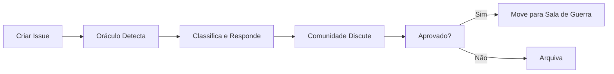
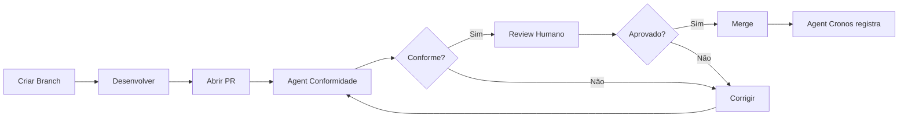
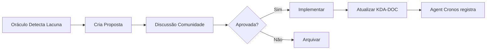

# Governança Sinergética - Oráculo do GitHub

Este documento descreve a governança do repositório `ideias-brutas` através do **Oráculo do GitHub**, nosso agente de conhecimento e conformidade.

## 🏛️ Estrutura de Governança

### A Constituição Sinergética

Nosso sistema opera segundo a **doutrina SI-p-POO-OC-ote®** (Sinergia, Integração, Princípios, Padrões, Orientação a Objetos, Observabilidade, Conformidade, Otimização, Transparência, Evolução).

### O Oráculo do GitHub

**Função:** Fonte única da verdade sobre como nosso "Aparelho de Estado" funciona.

**Poderes:**
1. **Monitorar** - Observar e responder a novos noids® (issues)
2. **Governar** - Verificar conformidade de Playbooks (PRs)
3. **Aprender** - Propor melhorias à própria base de conhecimento

**Base de Conhecimento:** [KDA-DOC] A Documentação Soberana do GitHub (Issue Eterna)

## 📚 Estrutura Documental

### Issue Eterna - [KDA-DOC]

A **Issue-Mãe** que contém nossa constituição e serve como RAG (Retrieval Augmented Generation) para o Oráculo.

### Cromossomos do Conhecimento (Sub-Issues)

Cada aspecto do sistema tem seu próprio cromossomo:

1. **[DOC] Agents** - Automação e inteligência
2. **[DOC] noids®** - Sistema de issues
3. **[DOC] Sala de Guerra** - Gestão visual
4. **[DOC] Arquivo Nacional** - Memória institucional
5. **[DOC] Playbooks** - Sistema de PRs
6. **[DOC] NF-Atos®** - Registro oficial
7. **[DOC] SI-p-POO-OC-ote®** - Arquitetura

## 🤖 Agents Automatizados

### Agent de Conformidade

**Workflow:** `.github/workflows/agent-conformidade.yml`

**Função:** Verifica automaticamente se PRs seguem a doutrina SI-p-POO-OC-ote®.

**Verificações:**
- Presença de descrição no PR
- Referência a noid® (issue)
- Tamanho adequado do PR
- Atualização de documentação relacionada

**Ação:** Comenta no PR com resultado da análise.

### Agent Cronos

**Workflow:** `.github/workflows/agent-cronos.yml`

**Função:** Registra automaticamente mudanças na documentação como NF-Atos® no Log Soberano.

**Monitora:**
- Arquivos `.md` (documentação)
- Issue templates
- Workflows

**Ação:** Adiciona comentário na issue do Log Soberano (#69 ou com label `log-soberano`).

## 📋 Vocabulário Oficial

Use sempre os termos da nossa doutrina:

| Termo GitHub | Termo Sinergético | Descrição |
|--------------|-------------------|-----------|
| Issue | **noid®** | Unidade de Vontade |
| Pull Request | **Playbook** | Decreto Executivo |
| Commit Log | **NF-Ato®** | Nota Fiscal de Atos |
| Documentation | **Cromossomo** | Conhecimento Organizado |
| Project Board | **Sala de Guerra** | Painel de Comando |
| Repository | **Arquivo Nacional** | Memória Viva |
| Maintainer | **Guardião** | Responsável |

## 🔄 Fluxo de Trabalho

### 1. Criação de noid® (Issue)



**Passos:**
1. Criar issue usando template apropriado
2. Oráculo analisa e sugere classificação
3. Comunidade discute e aprova
4. Issue é movida para coluna apropriada na Sala de Guerra

### 2. Desenvolvimento de Playbook (PR)



**Passos:**
1. Criar branch a partir de `main`
2. Desenvolver solução
3. Abrir PR referenciando noid®
4. Agent de Conformidade verifica automaticamente
5. Se conforme, aguarda review humano
6. Após aprovação, fazer merge
7. Agent Cronos registra NF-Ato®

### 3. Propostas de Fine-tuning



**Quando:** O Oráculo detecta ambiguidade ou lacuna na doutrina.

**Como:**
1. Criar issue com label `proposta:fine-tuning`
2. Descrever a lacuna identificada
3. Propor solução alinhada com SI-p-POO-OC-ote®
4. Comunidade discute e vota
5. Se aprovada, implementar e atualizar [KDA-DOC]

## 🎯 Labels Oficiais

### Por Tipo
- `KDA-DOC` - Documentação soberana
- `DOC` - Sub-documentação (cromossomos)
- `bug` - Não-conformidade ou erro
- `feature` - Nova funcionalidade
- `proposta:fine-tuning` - Melhoria na doutrina

### Por Prioridade
- `crítico` - Requer ação imediata
- `alto` - Importante, próximo sprint
- `médio` - Importante, backlog
- `baixo` - Pode esperar

### Por Status
- `triagem` - Aguardando classificação
- `aprovado` - Aprovado pela comunidade
- `em-andamento` - Sendo trabalhado
- `bloqueado` - Impedimento identificado
- `review` - Em revisão

### Especiais
- `log-soberano` - Issue que recebe NF-Atos®
- `oráculo` - Relacionado ao Oráculo do GitHub
- `agents` - Relacionado a agents/automação

## 📞 Como Convocar o Oráculo

### Em Issues ou PRs

```
/convocar @oraculo-github [sua pergunta]
```

### Referenciando Documentação

```
Conforme [KDA-DOC] #[número]
Ver [DOC] Agents #[número]
```

### Comandos Disponíveis

- `/convocar @oraculo-github [pergunta]` - Invocar o Oráculo
- `/classificar` - Solicitar classificação de noid®
- `/relacionar #[issue]` - Conectar com outro noid®
- `/status` - Ver status na Sala de Guerra

## ✅ Critérios de Conformidade

Todo Playbook (PR) deve:

1. **Ter descrição clara** - Explicar o que e por quê
2. **Referenciar noid®** - Vincular a uma issue
3. **Ser focado** - Uma responsabilidade por PR
4. **Incluir testes** - Se aplicável
5. **Atualizar docs** - Se necessário
6. **Seguir style guide** - Consistência com código existente

## 🔐 Princípios Fundamentais

### Transparência Total
Todas as decisões são documentadas e auditáveis.

### Autonomia com Supervisão
Agents operam autonomamente mas sob supervisão da comunidade.

### Aprendizado Contínuo
O sistema evolui através de propostas e fine-tunings.

### Conformidade Obrigatória
Nenhuma ação pode violar a constituição sinergética.

### Memória Institucional
Todo ato é registrado para conhecimento futuro.

## 🌱 Evolução da Governança

Esta governança é viva e evolui através de:

1. **Propostas de Fine-tuning** - Melhorias sugeridas pelo Oráculo ou comunidade
2. **NF-Atos®** - Histórico de mudanças no Log Soberano
3. **Retrospectivas** - Análises periódicas de efetividade
4. **Feedback da Comunidade** - Sugestões e críticas construtivas

## 📖 Referências

- [KDA-DOC] A Documentação Soberana do GitHub (Issue Eterna)
- [DOC] Agents (Sub-issue)
- [DOC] noids® (Sub-issue)
- [DOC] Sala de Guerra (Sub-issue)
- Prompt Gênese (`.github/copilot/prompt-genese.md`)
- Workflows (`.github/workflows/`)

---

**Última Atualização:** [Agent Cronos atualizará]  
**Versão:** 1.0  
**Status:** 🟢 Ativo

_"10% Humano - A FAÍSCA" + 90% Oráculo = 100% Sinergia_
